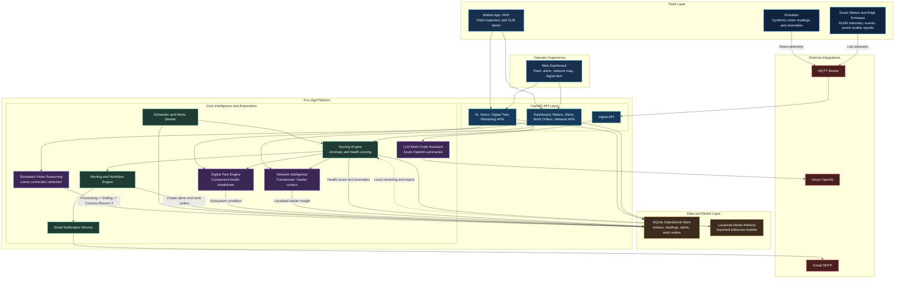

# Pro-Vigil Architecture Diagram

Use this single Mermaid block directly in Markdown, Mermaid Live, GitHub, or any Mermaid.js renderer.

```mermaid
flowchart TB
    classDef source fill:#10233f,stroke:#5ab0ff,color:#eef7ff,stroke-width:1.5px
    classDef client fill:#182f4d,stroke:#78d9ff,color:#eef7ff,stroke-width:1.5px
    classDef api fill:#17395c,stroke:#5fd1b3,color:#eefdf9,stroke-width:1.5px
    classDef service fill:#1f3c34,stroke:#6fe3b2,color:#ecfff7,stroke-width:1.5px
    classDef intelligence fill:#3a2753,stroke:#c697ff,color:#f7efff,stroke-width:1.5px
    classDef storage fill:#3b2c1f,stroke:#ffbf73,color:#fff7ed,stroke-width:1.5px
    classDef external fill:#4b1f1f,stroke:#ff8c8c,color:#fff1f1,stroke-width:1.5px

    subgraph SOURCES["Field Layer"]
        METERS["Smart Meters and Edge Firmware<br/>DLMS telemetry, events, power quality signals"]:::source
        SIM["Simulator<br/>Synthetic meter readings and anomalies"]:::source
        MOBILE["Mobile App / APK<br/>Field inspection and VLM demo"]:::client
    end

    subgraph EXPERIENCE["Operator Experience"]
        DASH["Web Dashboard<br/>Fleet, alerts, network map, digital twin"]:::client
    end

    subgraph PLATFORM["Pro-Vigil Platform"]
        subgraph API["FastAPI API Layer"]
            INGEST["Ingest API"]:::api
            COREAPI["Dashboard, Meters, Alerts,<br/>Work Orders, Network APIs"]:::api
            AIAPI["AI, Vision, Digital Twin,<br/>Retraining APIs"]:::api
        end

        subgraph SERVICES["Core Intelligence and Automation"]
            SCORE["Scoring Engine<br/>Anomaly and health scoring"]:::service
            NET["Network Intelligence<br/>Transformer / feeder context"]:::intelligence
            TWIN["Digital Twin Engine<br/>Component health breakdown"]:::intelligence
            LLM["LLM Work Order Assistant<br/>Azure OpenAI summaries"]:::intelligence
            VLM["Simulated Vision Reasoning<br/>Loose connection detection"]:::intelligence
            ALERT["Alerting and Workflow Engine"]:::service
            EMAIL["Email Notification Service"]:::service
            SCHED["Scheduler and Demo Seeder"]:::service
        end
    end

    subgraph DATA["Data and Model Layer"]
        DB["SQLite Operational Store<br/>meters, readings, alerts, work orders"]:::storage
        MODEL["Localized Model Artifacts<br/>exported inference models"]:::storage
    end

    subgraph INTEGRATIONS["External Integrations"]
        MQTT["MQTT Broker"]:::external
        AZURE["Azure OpenAI"]:::external
        SMTP["Gmail SMTP"]:::external
    end

    METERS -->|Live telemetry| MQTT
    SIM -->|Demo telemetry| MQTT
    MQTT --> INGEST
    INGEST --> SCORE

    SCORE -->|Health score and anomalies| DB
    SCORE --> NET
    SCORE --> TWIN
    SCORE --> ALERT
    SCORE --> MODEL

    NET -->|Localized feeder insight| DB
    TWIN -->|Subsystem condition| DB
    ALERT -->|Create alerts and work orders| DB
    ALERT --> EMAIL
    EMAIL --> SMTP
    SCHED --> SCORE
    SCHED --> DB

    DASH --> COREAPI
    DASH --> AIAPI
    MOBILE --> AIAPI
    MOBILE --> COREAPI

    COREAPI --> DB
    COREAPI --> NET
    COREAPI --> TWIN
    AIAPI --> LLM
    AIAPI --> VLM
    AIAPI --> DB

    LLM --> AZURE
    VLM -->|Processing -> finding -> Cosmos Reason 2| DB

    MODEL -. Local retraining and export .-> SCORE
```
